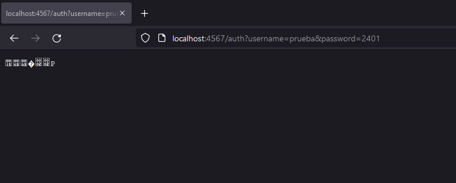
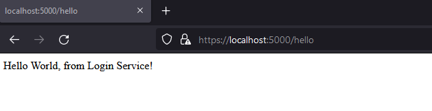
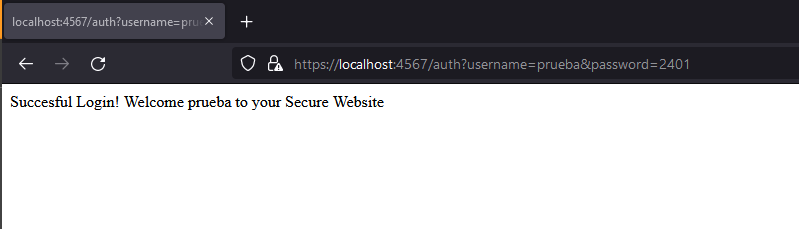
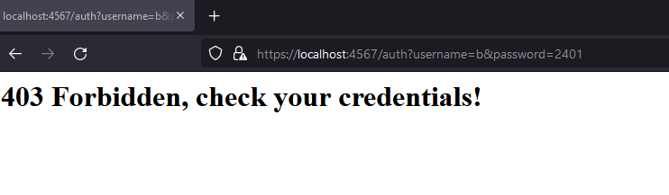
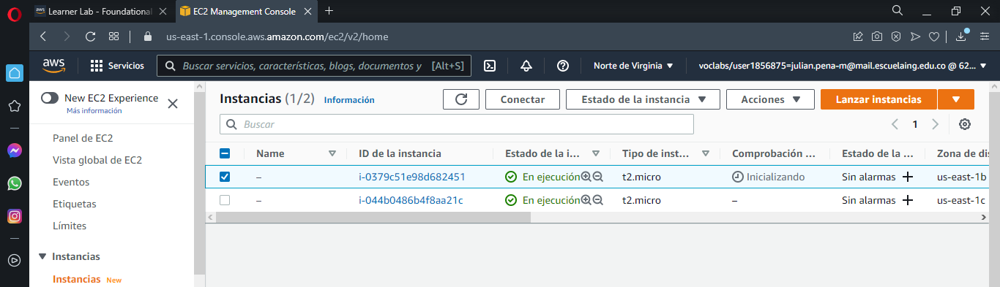
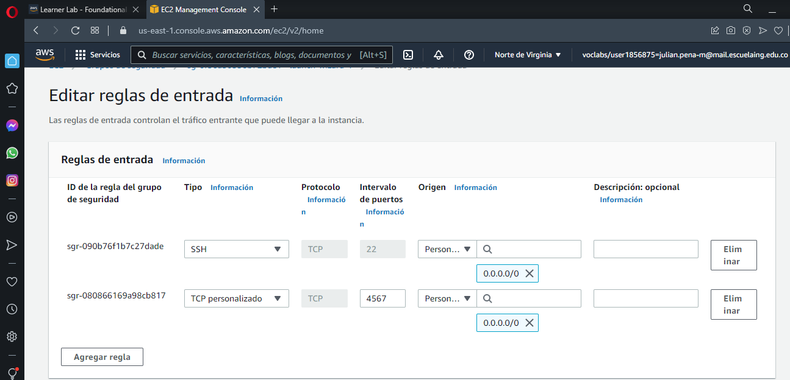

# Julian Adolfo Peña Marin

# Tarea aplicacion distribuida segura en todos sus frentes

El objetivo es construir una aplicacion segura, en donde se debe garantizar autenticación, autoraización e integridad de usuarios. La aplicacion esta compuesta por tres componentes, los cuales son:
 * El cliente(Browser)
 * Un servicio de login
 * Un servicio adicional, en este caso un servicio de autenticación
Cada servicio se corre en una maquina virtual por separado de AWS, mas especifico en unas instancias de EC2. 

## Descripcion de la arquitectura
Cada servicio esta conformado por un certificado propio, el servicio de login, hace una peticion get al servicio de autenticacion para poder acceder, si el usuario y la contraseña son correctas. Se manejan certificados debido a que se necesita una comunicacion segura a traves de https, ya sea entre el cliente y el servicio de login, como entre el servicio de login y autenticacion. A continuacion se muestra una imagen de la arquitectura.

 * El cliente es por donde se realizan las solicitudes al servicio de login.
 * El login service corre por el puerto 5000.
 * El authenticacion service corre por el puerto 4567

 ## Creacion de los certificados
 La arquitectura se puede escalar por medio de la generación de certificados propios de los nuevos servicios y la inclusión del certificado del nuevo servicio el archivo myTrustStore, para autorizar el acceso desde la que recibimos las credenciales, en el directorio de los certificados autorizados de LoginService. Así como conectando un endpoint del servicio principal para consumir el nuevo.
 
  * Usando los siguientes comandos poder generar, un par de llaves públicas y privadas y un certificado. Y los almacenamos todo en un archivo protegido. Se hace uso del formato PKCS12, un formato estándar para almacenar llaves y certificados.

  `keytool -genkeypair -alias ecikeypair -keyalg RSA -keysize 2048 -storetype PKCS12 -keystore ecikeystore.p12 -validity 3650`

  * Se exporta el certificado a un archivo con el siguiente comando.

  `keytool -export -keystore ./ecikeystore.p12 -alias ecikeypair -file ecicert.cer`

  * Por ultimo se importa el certificado a un myTrustStore.

  `keytool -import -file ./ecicert.cer -alias firstCA -keystore myTrustStore`

 ## Probando de manera local con los certificados

 Corriendo sin una comunicacion https, nos muestra la pagina con el mensaje, pero como oculto imposible de leer, comos se muestra a continuacion

 

 Para que no aparezca asi, se corre con una comunicacion https, con esto se asegura una comunicacion segura, mostrando claramente el mensaje de parte del servicio de login como se muestra a continuacion

Y el mensaje del serviciod e autenticacion, como se muestra a continuacion

Una vez que se corra con una comunicacion https y el usuario sea validado, en este caso se crea un solo usuario para efectos de prueba, con la siguiente informacion

 * Username: prueba
 * password: 2401

Una vez validada la informacion, aparece el mensaje dandonos acceso, como se muestra a continuacion

Si el usuario es incorrecto se muestra un mensaje de error, informando que revise las credenciales, como se muestra a continuacion

## Despliegue en AWS
Primero se crean las dos instancias de EC2 para cada servicio, con el par de llaves para poder conectarse a cada maquina a traves de SSH.

Despues se instala git y java en cada una de las maquinas, con el fin de clonar el proyecto y correr en cada maquina un servico. Para esto utilizamos los siguientes comandos:

 * Instalar git: sudo yum install git
 * Instalar java: sudo yum install java-1.8.0

Una vez instaladas, se ingresa a la ruta ec2-user y se clona el proyecto
 * cd "/home/ec2-user/"
 * git clone UrlRepositorio

Ejecute las instancias con el siguiente comando
 * java -cp "target/classes:target/dependency/*" "[Nombre de la clase main]"

Por ultimo se debe habilitar en el security group de cada maquina, el pueto para acceder a los servicios, en este caso el pueto es el 4567

